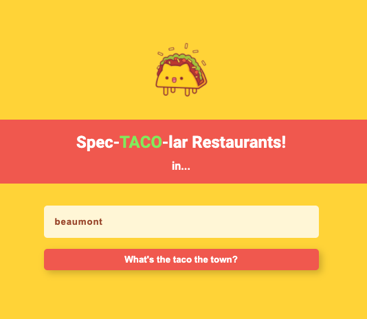

# Spec-TACO-lar Restaurants!

### Live site:

<a href="https://young-fortress-80326.herokuapp.com/">https://young-fortress-80326.herokuapp.com/</a>

An app that finds the best taco restaurants in your area!

## Instructions:

1. Open the page
2. Enter your city or zipcode
3. Submit then voila! Shows you all the recommended taco restaurants :) You can sort the order too!

## Technologies used:

- Figma
- React (Hooks)
- React Router
- SASS
- Storybook
- Yelp API

## Design Mock Up:

<a href="https://www.figma.com/file/TXLRo7iMu7LC4LpRAcgXZ6/SpecTACOlar-Restaurants">Link to mock up on Figma</a>

## How to run the app locally:

1. Clone this repository
2. In the terminal navigate to the root folder of the app and run `npm install`
3. After the modules are all installed, run the app using `npm start`
4. The app should be running on `http://localhost:3000/`

## Some things I'd like to work on:

1. Utilize React Router to make multiple pages focusing on the details of the business
2. Make better animation
3. Integrated map
4. Include reviews

### Happy coding!!
